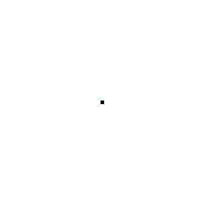
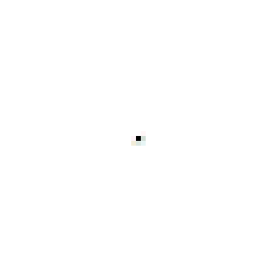
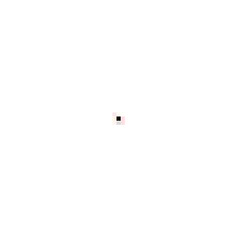
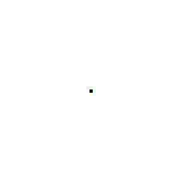
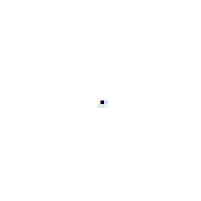
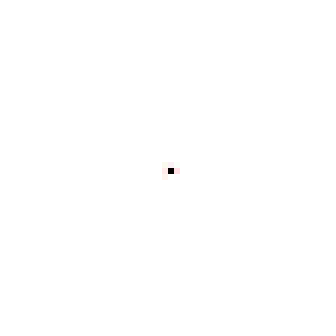
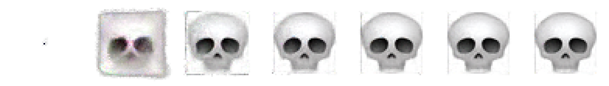

# Pixel Morphogenesis

A single pixel grows into a target image through purely local interactions — no global coordination, no blueprint. Inspired by biological morphogenesis, where a single cell develops into a complex organism using only local chemical signals.

<p align="center">
  
</p>

**[Try the interactive demo](https://alixmixx.github.io/Pixel-Morphogenesis/)** — click and drag to damage cells and watch them regenerate in real time.

## Results

### Growth

Each model learns to grow its target from a single seed pixel in ~200 steps:

<p align="center">
  
  
  
</p>

### Regeneration

After damage training, the models learn to detect and repair missing regions — the same local rule that grows the shape also heals it:

<p align="center">
  
  
  
</p>

### Training progression

From blurry blob to sharp skull over 12,000 training steps:

<p align="center">
  
</p>

## How it works

Each pixel is a cell with **32 channels** (4 RGBA + 28 hidden state). Cells can only see their immediate neighbors through Sobel edge-detection filters. A small neural network (~25K parameters) decides how each cell updates based on what it perceives.

```
Seed (single pixel)
  │
  ▼  ×N steps
┌─────────────────────────────────────────────────┐
│  Perceive    ─  depthwise 3×3 Sobel filters     │
│  Update      ─  1×1 conv → ReLU → 1×1 conv      │
│  Alive Mask  ─  max pool on alpha (apoptosis)    │
│  Stochastic  ─  random dropout (async updates)   │
│  Residual    ─  x = x + masked_update            │
└─────────────────────────────────────────────────┘
  │
  ▼
Target image
```

Key design choices:
- **Fixed Sobel perception** — cells sense identity + spatial gradients, not learned filters
- **Zero-initialized output** — the model starts by doing nothing, avoiding early chaos
- **Stochastic updates** — 20% dropout per element forces robustness to async execution
- **Sample pool** — 1024 partially-grown states train persistence and regeneration
- **Damage injection** — after step 6K, random rectangular regions are zeroed out

See [ARCHITECTURE.md](ARCHITECTURE.md) for a deep dive into every design decision.

## Quick start

```bash
pip install -r requirements.txt

# train on the skull emoji (12K steps, ~10 min on MPS)
python train.py

# export weights for browser inference
python export.py --input outputs/nca_pool.pt --output docs/models/skull.json

# generate growth and regeneration GIFs
python tests/check_viz.py
python tests/check_regen.py
```

### Train your own target

Drop any RGBA PNG into `targets/`, then edit `TARGET_PATH` in `train.py`:

```python
TARGET_PATH = "targets/your_image.png"
```

The image gets resized to 40x40 and padded to 56x56. High-contrast shapes with clear silhouettes work best.

Included targets: `skull.png`, `lizard.png`, `heart.png`, `butterfly.png`, `sunflower.png`, `mushroom.png`

## Project structure

```
nca/
  model.py        NCA model — perception, update rule, alive masking
  data.py         target loading (premultiplied alpha, padding) and seed creation
  pool.py         sample pool for persistent training
  damage.py       damage injection for regeneration training
  visualize.py    GIF export with alpha compositing
train.py          training loop with gradient normalization and damage scheduling
export.py         serialize weights to JSON for browser inference
tests/            diagnostic scripts for each pipeline stage
docs/             interactive browser demo (vanilla JS, no dependencies)
targets/          target PNG images (RGBA)
outputs/          trained models and generated GIFs
```

## Interactive demo

The `docs/` folder contains a standalone browser demo that runs the trained NCA in real time using vanilla JavaScript — no WebGL, no frameworks. The forward pass (~50M multiply-adds per step for a 56x56 grid) runs at 30fps in pure JS.

Click and drag on the canvas to destroy cells and watch the organism repair itself.

## References

- Mordvintsev et al. — [Growing Neural Cellular Automata](https://distill.pub/2020/growing-ca/), Distill 2020
- Niklasson et al. — [Self-Organising Textures](https://distill.pub/selforg/2021/textures/), Distill 2021
- Greydanus — [Studying Growth with Neural Cellular Automata](https://greydanus.github.io/2022/05/24/studying-growth/), 2022
- Gilpin — [Cellular Automata as Convolutional Neural Networks](https://arxiv.org/abs/1809.02942), Physical Review E 2018
- Chan — [Lenia: Biology of Artificial Life](https://arxiv.org/abs/2005.03742), 2020

Target emoji from [Twemoji](https://github.com/twitter/twemoji) (CC-BY 4.0).

## License

MIT
